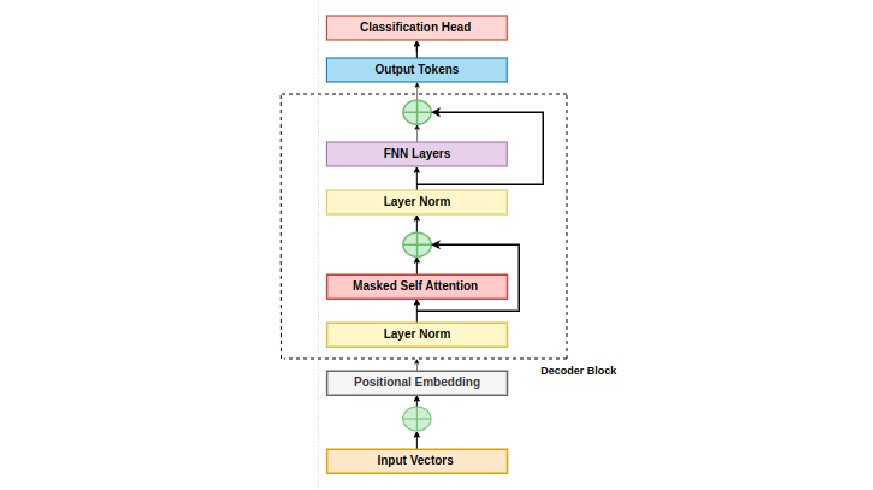

# ChatGPT2-Scratch

## Overview
Here's an implementation of a GPT-2 inspired language model built from scratch using PyTorch. The project follows a step-by-step approach to constructing a Transformer-based language model, including data preprocessing, tokenization, and training on the Tiny Shakespeare dataset.

## Features
- Implements a Bigram Language Model (Baseline Model)
- Uses PyTorch for efficient tensor operations
- Self-attention mechanism for sequence modeling
- Data tokenization and embedding layers
- Implements a Decoder Only Model (GPT-2 Inspired Model)
- Training on a character-level dataset
- Supports text generation

## Architecture

## Future Work
- Implementing a full GPT-2 architecture
- Adding support for byte-pair encoding (BPE)
- Experimenting with larger datasets and improved training techniques

## Contributing
Feel free to fork this repository, submit pull requests, or open issues for any enhancements.